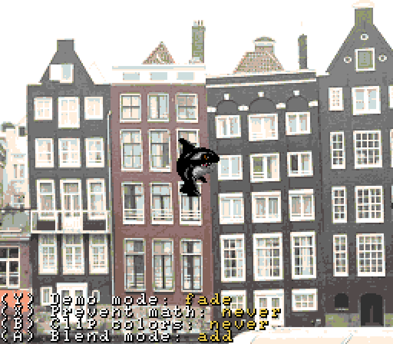

The SNES offers some cool abilities to perform color blending math between layers.
Also, this demo was my first experience with displaying debug text in a Super Nintendo application and I"m pleased with the results there as well.

## Blend the Main screen with the Sub screen
### Blend modes
_Add_ (bright), _Subtract_ (dark), or _Add Then Half_ (just make the subscreen look transparent)

### Window clipping ("prevent color math")
Uses what I learned in the `window` demo to prevent color math (in this case, make the subscreen invisible) outside/inside the window.

### Clip colors
A little harder to wrap your head around, but in simple terms, it tells the SNES to _only display the subscreen_ in some areas.

### 

## Blend with a fixed color
### Fade

### Gradient
use HDMA to write to `COLDATA` every scanline

